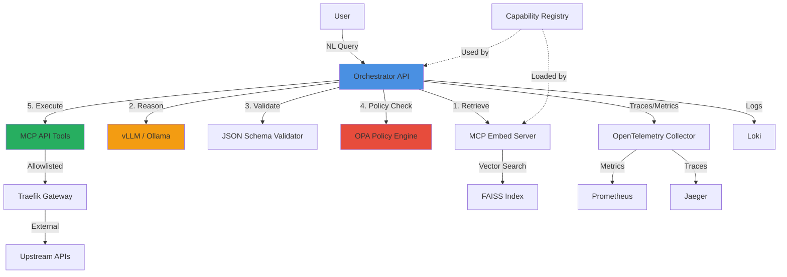
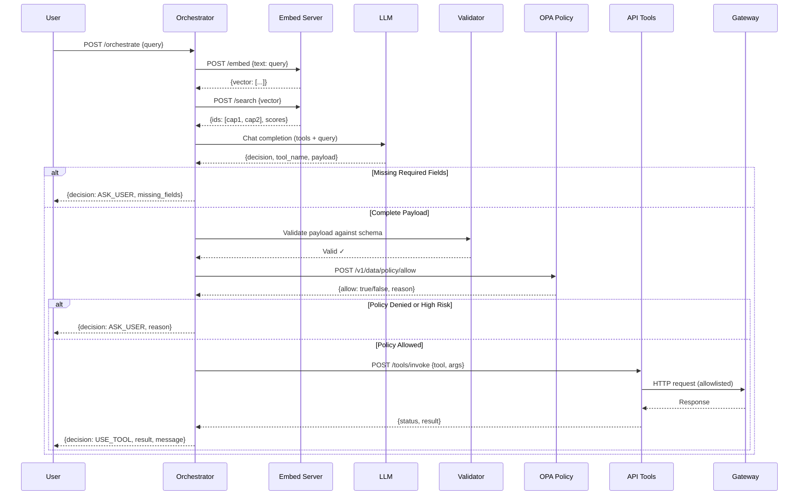

# NL → API Orchestrator

A **local, dockerized natural language to API orchestrator** that intelligently routes user queries to appropriate APIs using RAG, LLM reasoning, and policy enforcement.

## 🏗️ Architecture



## 🔄 Sequence Flow



## 🚀 Quick Start

### Prerequisites

- Docker 20.10+
- Docker Compose 2.0+
- 16GB+ RAM recommended (for local LLM)
- 20GB+ disk space

### 1. Clone and Configure

```bash
cd nl-api-orchestrator
cp .env.example .env
# Edit .env if needed (defaults work out-of-box)
```

### 2. Start All Services

```bash
docker compose up -d --build
```

This will start:
- **orchestrator** (FastAPI) on `:8080`
- **vllm** (LLM server) on `:8000`
- **mcp-embed** (embeddings) on `:9001`
- **mcp-api** (API tools) on `:9000`
- **mcp-policy** (OPA) on `:8181`
- **traefik** (gateway) on `:80`
- Optional: **jaeger**, **prometheus**, **grafana** for observability

### 3. Wait for Services to be Ready

```bash
# Check orchestrator health
curl http://localhost:8080/health

# Wait for vLLM to load model (can take 2-5 minutes)
docker compose logs -f vllm
```

### 4. Test an Orchestration

```bash
curl -X POST http://localhost:8080/orchestrate \
  -H "Content-Type: application/json" \
  -d '{"query":"Open urgent ticket for payment failure"}' | jq
```

**Expected Response:**

```json
{
  "decision": "USE_TOOL",
  "tool_used": "create_ticket",
  "request_payload": {
    "title": "Payment failure",
    "description": "Gateway errors for user payment processing",
    "priority": "urgent"
  },
  "api_result": {
    "status": "ok",
    "ticket_id": "TKT-12345"
  },
  "message": "Successfully created urgent ticket for payment failure.",
  "session_id": "..."
}
```

## 📝 More Examples

### Query with Missing Information

```bash
curl -X POST http://localhost:8080/orchestrate \
  -H "Content-Type: application/json" \
  -d '{"query":"Create a ticket"}' | jq
```

**Response:**

```json
{
  "decision": "ASK_USER",
  "tool_name": "create_ticket",
  "missing_fields": ["title", "description", "priority"],
  "message": "I need more information to create a ticket. Please provide: title, description, priority",
  "session_id": "..."
}
```

### List Available Tickets

```bash
curl -X POST http://localhost:8080/orchestrate \
  -H "Content-Type: application/json" \
  -d '{"query":"Show me all open tickets"}' | jq
```

### No Matching Tool

```bash
curl -X POST http://localhost:8080/orchestrate \
  -H "Content-Type: application/json" \
  -d '{"query":"What is the weather today?"}' | jq
```

**Response:**

```json
{
  "decision": "NONE",
  "message": "I don't have access to tools that can help with this request.",
  "session_id": "..."
}
```

## 🔧 Configuration

### Switching LLM Provider: vLLM ↔ Ollama

**vLLM (default)** - Faster, OpenAI-compatible:

```env
LLM_PROVIDER=vllm
OPENAI_BASE_URL=http://vllm:8000/v1
MODEL_NAME=meta-llama/Meta-Llama-3.1-8B-Instruct
```

**Ollama** - Easier model management:

1. Edit `docker-compose.yml`: comment out `vllm` service, uncomment `ollama`
2. Update `.env`:

```env
LLM_PROVIDER=ollama
OPENAI_BASE_URL=http://ollama:11434/v1
MODEL_NAME=llama3.1:8b
```

3. Restart:

```bash
docker compose up -d --build
```

### Environment Variables

See `.env.example` for all options:

| Variable | Description | Default |
|----------|-------------|---------|
| `LLM_PROVIDER` | `vllm` or `ollama` | `vllm` |
| `MODEL_NAME` | LLM model identifier | `meta-llama/Meta-Llama-3.1-8B-Instruct` |
| `EMBED_MODEL` | Sentence transformer model | `BAAI/bge-small-en-v1.5` |
| `ALLOWLIST_PREFIXES` | Comma-separated URL prefixes | `https://api.example.com/` |
| `OPA_URL` | Policy engine endpoint | `http://mcp-policy:8181/v1/data/policy/allow` |
| `API_TOKEN` | Demo API token | `demo-token` |

## 🛠️ Adding New API Tools

### 1. Add Capability Card

Edit `orchestrator/registry/capabilities.json`:

```json
{
  "name": "send_email",
  "description": "Send an email to a recipient with subject and body",
  "endpoint": "POST https://api.example.com/emails",
  "auth": "bearer",
  "risk": "low",
  "input_schema": {
    "type": "object",
    "properties": {
      "to": {"type": "string", "format": "email"},
      "subject": {"type": "string", "minLength": 1},
      "body": {"type": "string", "minLength": 10}
    },
    "required": ["to", "subject", "body"]
  },
  "examples": [
    {
      "user": "Email John about the meeting",
      "payload": {
        "to": "john@example.com",
        "subject": "Meeting Reminder",
        "body": "Don't forget our meeting tomorrow at 10am"
      }
    }
  ]
}
```

### 2. Implement Tool Handler

Create `mcp/api_tools/src/tools/send_email.py`:

```python
import httpx
from typing import Dict, Any

async def send_email(args: Dict[str, Any], allowlist: list, token: str) -> Dict[str, Any]:
    """Send email via upstream API."""
    endpoint = "https://api.example.com/emails"
    
    # Allowlist check happens in server.py
    
    async with httpx.AsyncClient() as client:
        response = await client.post(
            endpoint,
            json=args,
            headers={"Authorization": f"Bearer {token}"},
            timeout=30.0
        )
        response.raise_for_status()
        return {"status": "ok", "email_id": response.json().get("id")}
```

### 3. Register Tool

Add to `mcp/api_tools/src/tools/__init__.py`:

```python
from .send_email import send_email

TOOLS = {
    "create_ticket": create_ticket,
    "list_tickets": list_tickets,
    "send_email": send_email,  # Add this
}
```

### 4. Rebuild and Test

```bash
docker compose up -d --build mcp-api orchestrator
curl -X POST http://localhost:8080/orchestrate \
  -H "Content-Type: application/json" \
  -d '{"query":"Email john@example.com about the deployment"}' | jq
```

## 🔒 Security & Guardrails

### 1. URL Allowlisting

All outbound API calls are checked against `ALLOWLIST_PREFIXES`:

```python
# In mcp/api_tools/src/server.py
def is_allowed(url: str, allowlist: list) -> bool:
    return any(url.startswith(prefix) for prefix in allowlist)
```

Add more prefixes in `.env`:

```env
ALLOWLIST_PREFIXES=https://api.example.com/,https://api.trusted.com/,https://internal.corp/
```

### 2. JSON Schema Validation

Every payload is validated against the capability's `input_schema`:

```python
# In orchestrator/src/validators.py
from jsonschema import validate, ValidationError

def validate_payload(payload: dict, schema: dict) -> tuple[bool, str]:
    try:
        validate(instance=payload, schema=schema)
        return True, ""
    except ValidationError as e:
        return False, e.message
```

### 3. Policy Enforcement (OPA)

Policies defined in `mcp/policy/policy.rego`:

```rego
package policy

default allow = false

# Allow low/medium risk operations with valid payload
allow {
    input.risk != "high"
    input.payload.description
    count(input.payload.description) >= 10
}

# High-risk requires explicit confirmation
allow {
    input.risk == "high"
    input.confirmed == true
}
```

### 4. Normalization

Common synonyms are normalized before validation:

```python
# In orchestrator/src/normalizers.py
PRIORITY_MAP = {
    "asap": "urgent",
    "critical": "urgent",
    "low priority": "low",
    "normal": "medium",
}
```

### 5. Risk-Based Confirmation

High-risk operations return `ASK_USER` with details:

```json
{
  "decision": "ASK_USER",
  "tool_name": "delete_database",
  "reason": "High-risk operation requires explicit confirmation",
  "confirm_fields": {
    "database": "production_db",
    "action": "delete"
  }
}
```

## 📊 Observability

### Logs

Structured JSON logs with correlation IDs:

```bash
docker compose logs -f orchestrator
```

### Traces (Jaeger)

View distributed traces at [http://localhost:16686](http://localhost:16686)

### Metrics (Prometheus)

Scrape metrics at [http://localhost:9090](http://localhost:9090)

- `orchestrator_requests_total{decision, tool}`
- `orchestrator_request_duration_seconds`
- `orchestrator_llm_tokens_total`

### Dashboards (Grafana)

Pre-built dashboard at [http://localhost:3000](http://localhost:3000) (admin/admin)

## 🧪 Testing

### Run Unit Tests

```bash
docker compose run --rm orchestrator pytest tests/ -v
```

### Test Coverage

```bash
docker compose run --rm orchestrator pytest tests/ --cov=src --cov-report=html
```

### Manual Testing

See `orchestrator/tests/` for examples:

- `test_orchestrate_happy.py` - Happy path E2E
- `test_validation.py` - Schema validation edge cases
- `conftest.py` - Pytest fixtures with mocks

## 🐛 Troubleshooting

### Services Not Starting

```bash
# Check service status
docker compose ps

# View logs for specific service
docker compose logs ollama
docker compose logs orchestrator
```

### Ollama Model Issues

Pull the model manually if needed:

```bash
docker compose exec ollama ollama pull llama3.1:8b
```

Reduce model size or use a smaller model:

```env
# Use smaller model
MODEL_NAME=meta-llama/Meta-Llama-3.1-8B-Instruct-AWQ
```

### LLM Not Returning JSON

Some models need fine-tuning prompts. Check `orchestrator/src/prompts.py` and adjust:

```python
SYSTEM_PROMPT = """You MUST respond with valid JSON only. No markdown, no explanations..."""
```

### Embedding Search Returns No Results

Check that capabilities are loaded:

```bash
curl http://localhost:9001/health
docker compose logs mcp-embed
```

### Policy Denying Valid Requests

Check OPA logs and policy:

```bash
docker compose logs mcp-policy
# Edit mcp/policy/policy.rego
docker compose restart mcp-policy
```

## 🛠️ Utilities

### Convert OpenAPI to Capabilities

```bash
docker compose run --rm orchestrator python -m src.openapi_to_caps \
  path/to/openapi.yaml \
  output/capabilities.json
```

### Rebuild Embeddings Index

```bash
docker compose restart mcp-embed
```

The embed server rebuilds its FAISS index from `capabilities.json` on startup.

## 📚 API Reference

### POST /orchestrate

**Request:**

```json
{
  "query": "string (required)",
  "session_id": "string (optional)",
  "confirmed": "boolean (optional, for high-risk operations)"
}
```

**Response:**

```json
{
  "decision": "USE_TOOL | ASK_USER | NONE",
  "tool_used": "string | null",
  "tool_name": "string | null",
  "request_payload": "object | null",
  "api_result": "object | null",
  "message": "string",
  "missing_fields": "array | null",
  "session_id": "string",
  "confirm_fields": "object | null"
}
```

### GET /health

**Response:**

```json
{
  "status": "ok",
  "timestamp": "2026-02-12T14:30:00Z",
  "services": {
    "llm": "healthy",
    "embed": "healthy",
    "api_tools": "healthy",
    "policy": "healthy"
  }
}
```

## 🗂️ Project Structure

```
nl-api-orchestrator/
├── README.md                          # This file
├── docker-compose.yml                 # Service orchestration
├── .env.example                       # Environment template
├── orchestrator/                      # Main orchestrator service
│   ├── Dockerfile
│   ├── requirements.txt
│   ├── registry/
│   │   └── capabilities.json          # API capability cards
│   ├── src/
│   │   ├── app.py                     # FastAPI application
│   │   ├── settings.py                # Configuration loader
│   │   ├── tool_router.py             # Routing logic
│   │   ├── validators.py              # JSON schema validation
│   │   ├── normalizers.py             # Payload normalization
│   │   ├── mcp_client.py              # MCP API tools client
│   │   ├── opa_client.py              # OPA policy client
│   │   ├── retriever.py               # RAG capability retrieval
│   │   ├── openapi_to_caps.py         # OpenAPI converter utility
│   │   ├── prompts.py                 # LLM prompts
│   │   └── logging_conf.py            # Structured logging setup
│   └── tests/
│       ├── test_orchestrate_happy.py
│       ├── test_validation.py
│       └── conftest.py
├── mcp/                               # MCP-style tool servers
│   ├── api_tools/                     # Business API executor
│   │   ├── Dockerfile
│   │   ├── requirements.txt
│   │   └── src/
│   │       ├── server.py
│   │       └── tools/
│   │           ├── create_ticket.py
│   │           ├── list_tickets.py
│   │           └── __init__.py
│   ├── embed_tools/                   # Embeddings & vector search
│   │   ├── Dockerfile
│   │   ├── requirements.txt
│   │   └── src/
│   │       └── server.py
│   └── policy/                        # OPA policies
│       └── policy.rego
├── gateway/                           # Traefik config
│   └── traefik.yml
└── ops/                               # Observability configs
    ├── otelcol-config.yaml
    ├── prometheus.yml
    ├── loki-config.yaml
    ├── promtail-config.yml
    └── grafana-provisioning/
        ├── dashboards/
        │   └── nl-api-overview.json
        └── datasources/
            └── datasource.yml
```

## 📄 License

MIT License - See LICENSE file for details

## 🤝 Contributing

1. Fork the repository
2. Create a feature branch
3. Add tests for new functionality
4. Ensure all tests pass
5. Submit a pull request

## 💡 Tips

- Start with the default vLLM setup, it's faster than Ollama
- Add capabilities incrementally and test each one
- Use `session_id` for multi-turn conversations (future enhancement)
- Monitor memory usage with `docker stats`
- Check OPA policies frequently when debugging authorization issues

## 📞 Support

For issues, questions, or contributions, please open an issue on GitHub.

---

**Built with ❤️ for agentic AI workflows**

